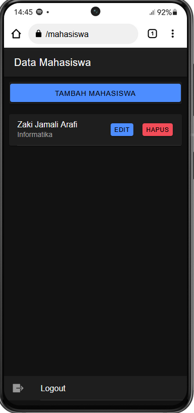

    Nama       : Zaki Jamali Arafi

    NIM        : H1D022048

    Shift Baru : D

# Tugas 8 - Pertemuan 9
## CRUD Ionic

### 1. Login

Bagian login bertanggung jawab untuk mengautentikasi pengguna. Pengguna memasukkan username dan password, kemudian aplikasi memverifikasi kredensial tersebut dengan data yang ada di server.

- Login Page: Pengguna melihat halaman login dengan form untuk memasukkan username dan password.
- Setelah Login Berhasil: Pengguna diarahkan ke halaman utama (misalnya, halaman mahasiswa) jika login berhasil.
- Setelah Login Gagal: Pengguna tetap di halaman login dan melihat notifikasi bahwa login gagal.

### 2. Read

Bagian ini bertanggung jawab untuk membaca atau mengambil data dari server dan menampilkannya kepada pengguna.

- Halaman Data Mahasiswa: Pengguna melihat daftar data mahasiswa yang diambil dari server dan ditampilkan dalam bentuk tabel atau kartu.

### 3. Create

Bagian ini bertanggung jawab untuk membuat atau menambahkan data baru ke server.

- Form Tambah Mahasiswa: Pengguna melihat form untuk menambahkan data mahasiswa baru.
- Setelah Data Ditambahkan: Pengguna diarahkan kembali ke halaman daftar mahasiswa dengan data baru yang sudah ditambahkan.

### 4. Update

Bagian ini bertanggung jawab untuk memperbarui data yang sudah ada di server.

- Form Edit Mahasiswa: Pengguna melihat form untuk mengedit data mahasiswa yang sudah ada.
- Setelah Data Diperbarui: Pengguna diarahkan kembali ke halaman daftar mahasiswa dengan data yang sudah diperbarui.

### 5. Delete

Bagian ini bertanggung jawab untuk menghapus data dari server.

- Konfirmasi Hapus: Pengguna melihat dialog konfirmasi sebelum data dihapus.
- Setelah Data Dihapus: Pengguna diarahkan kembali ke halaman daftar mahasiswa dengan data yang sudah dihapus.